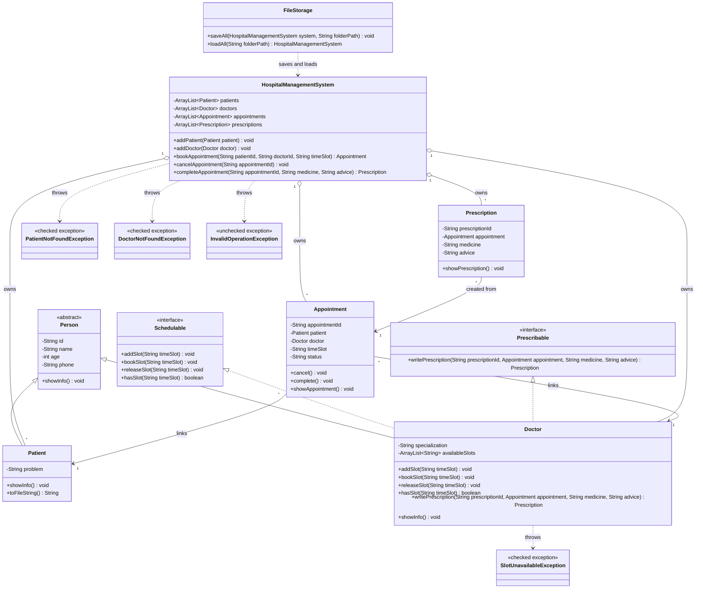

# Hospital Management System

This is a CSE110 OOP project based on the idea:

```text
Person (abstract)
 |-- Patient
 `-- Doctor implements Schedulable, Prescribable

Schedulable
Prescribable
Appointment
Prescription
HospitalManagementSystem
FileStorage
Custom exceptions
```

## UML Class Diagram



## Main Classes

| Class | Purpose |
|---|---|
| `Person` | Abstract parent class for common person data |
| `Patient` | Stores patient information |
| `Doctor` | Stores doctor information and handles slots/prescriptions |
| `Appointment` | Links patient, doctor, and time slot |
| `Prescription` | Created after completing an appointment |
| `HospitalManagementSystem` | Manages all patients, doctors, appointments, and prescriptions |
| `FileStorage` | Saves and loads data from disk |

## Interfaces

| Interface | Used By | Purpose |
|---|---|---|
| `Schedulable` | `Doctor` | Add, book, release, and check slots |
| `Prescribable` | `Doctor` | Write prescription after appointment |

## Exceptions

| Exception | Type | When It Happens |
|---|---|---|
| `SlotUnavailableException` | Checked | Slot is already booked or does not exist |
| `PatientNotFoundException` | Checked | Patient ID is unknown |
| `DoctorNotFoundException` | Checked | Doctor ID is unknown |
| `InvalidOperationException` | Unchecked | Duplicate IDs, double cancel, completing cancelled appointment |

## Flow

```text
Create HospitalManagementSystem
Create patients
Create doctors
Add available slots to doctors
Add patients and doctors to system
Book appointment using patient ID, doctor ID, and time slot
Doctor slot is removed after booking
Complete appointment
Doctor writes prescription
Cancel appointment if needed
Cancelled slot is released back to doctor
Save all data to files
Load all data from files
```

## File Storage

When the demo runs, data is saved into:

```text
data
```

Files:

```text
patients.txt
doctors.txt
appointments.txt
prescriptions.txt
```

## How To Run

From:

```text
C:\programming-task-folder\java\OOP_PROJECT
```

Compile:

```powershell
javac *.java
```

Run:

```powershell
java HospitalMain
```
